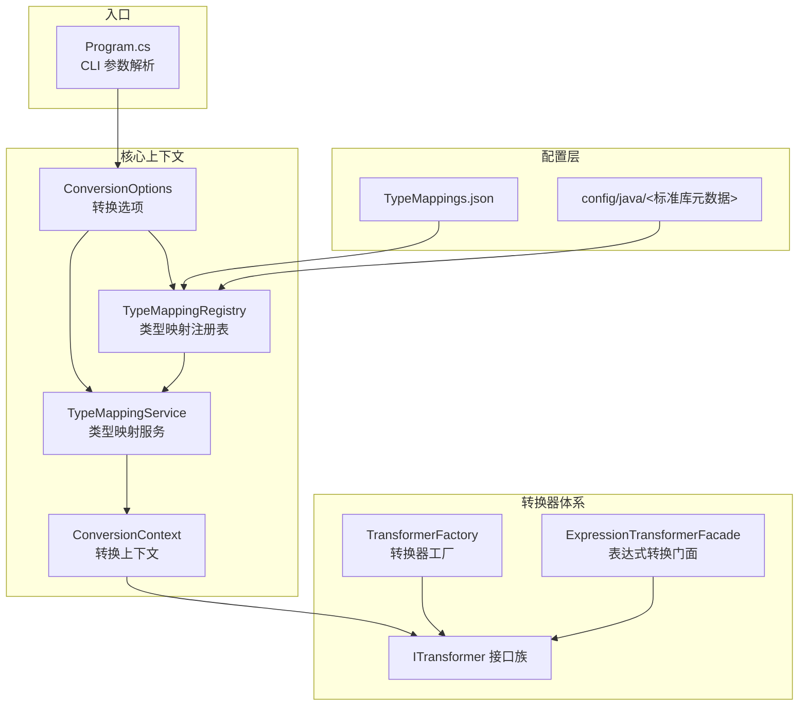
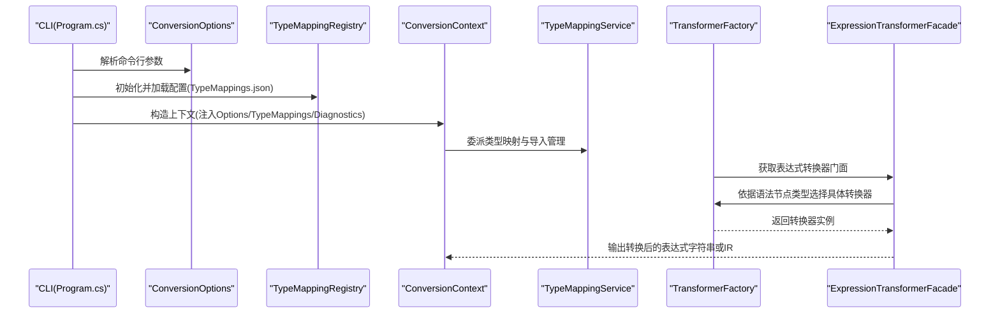
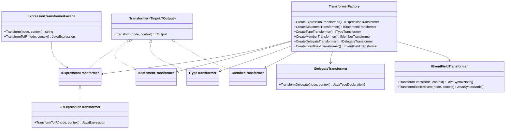
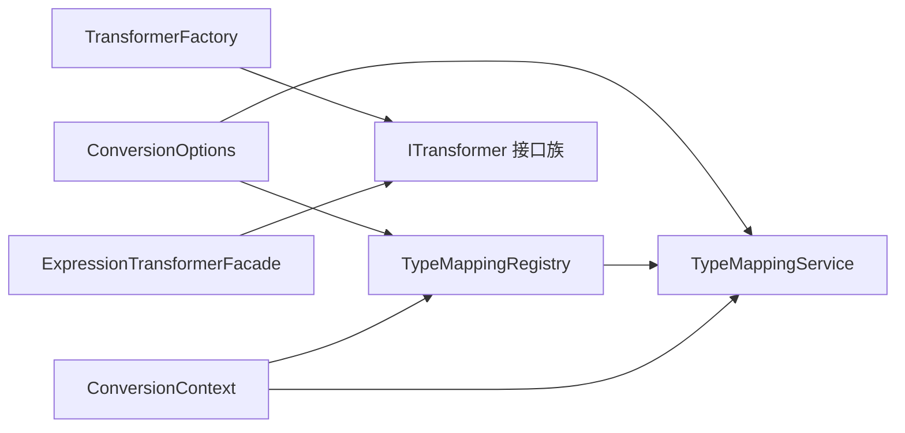

# 配置和定制

<cite>
**本文档引用的文件**
- [TypeMappings.json](file://config/TypeMappings.json)
- [ConversionOptions.cs](file://src/CSharpToJava.Core/Context/ConversionOptions.cs)
- [TypeMappingService.cs](file://src/CSharpToJava.Core/Context/TypeMappingService.cs)
- [TypeMappingRegistry.cs](file://src/CSharpToJava.TypeMapping/TypeMappingRegistry.cs)
- [ConversionContext.cs](file://src/CSharpToJava.Core/Context/ConversionContext.cs)
- [Object.json](file://config/java/java.base/java/lang/Object.json)
- [Program.cs](file://src/CSharpToJava.CLI/Program.cs)
- [ITransformer.cs](file://src/CSharpToJava.Core/Abstractions/ITransformer.cs)
- [TransformerFactory.cs](file://src/CSharpToJava.Core/Transformers/TransformerFactory.cs)
- [ExpressionTransformerFacade.cs](file://src/CSharpToJava.Core/Transformers/Expression/ExpressionTransformerFacade.cs)
- [ExpressionTransformerHelpers.cs](file://src/CSharpToJava.Core/Transformers/Expression/Utilities/ExpressionTransformerHelpers.cs)
</cite>

## 目录
1. [简介](#简介)
2. [项目结构](#项目结构)
3. [核心组件](#核心组件)
4. [架构总览](#架构总览)
5. [详细组件分析](#详细组件分析)
6. [依赖关系分析](#依赖关系分析)
7. [性能考量](#性能考量)
8. [故障排查指南](#故障排查指南)
9. [结论](#结论)
10. [附录](#附录)

## 简介
本章节面向需要对 cs2j 进行配置与定制的用户，系统性阐述类型映射配置、转换选项、自定义转换器开发流程与接口规范，并给出配置优先级与覆盖机制、扩展与定制示例以及常见场景的最佳实践。目标是帮助不同层次的用户快速掌握从基础配置到高级定制的完整能力。

## 项目结构
cs2j 的配置与定制涉及以下关键模块：
- 配置层：TypeMappings.json 提供类型映射、方法映射与命名空间映射；config/java 下的 Java 标准库元数据用于方法名自动推断与 API 可用性校验。
- 上下文与选项：ConversionOptions 定义转换行为开关与参数；ConversionContext/TypeMappingService 统一承载转换状态与映射逻辑。
- 类型映射注册表：TypeMappingRegistry 负责加载、解析与应用配置，支持方法签名感知的重载解析与 Java 元数据验证。
- CLI 层：Program.cs 将命令行参数映射到 ConversionOptions 并驱动转换流水线。
- 转换器体系：ITransformer/TransformerFactory/ExpressionTransformerFacade 提供统一的转换器接口与门面，支持表达式、语句、成员、类型等多类转换。

图表来源
- [TypeMappings.json](file://config/TypeMappings.json)
- [ConversionOptions.cs](file://src/CSharpToJava.Core/Context/ConversionOptions.cs)
- [TypeMappingService.cs](file://src/CSharpToJava.Core/Context/TypeMappingService.cs)
- [TypeMappingRegistry.cs](file://src/CSharpToJava.TypeMapping/TypeMappingRegistry.cs)
- [ConversionContext.cs](file://src/CSharpToJava.Core/Context/ConversionContext.cs)
- [Program.cs](file://src/CSharpToJava.CLI/Program.cs)
- [ITransformer.cs](file://src/CSharpToJava.Core/Abstractions/ITransformer.cs)
- [TransformerFactory.cs](file://src/CSharpToJava.Core/Transformers/TransformerFactory.cs)
- [ExpressionTransformerFacade.cs](file://src/CSharpToJava.Core/Transformers/Expression/ExpressionTransformerFacade.cs)

章节来源
- [Program.cs](file://src/CSharpToJava.CLI/Program.cs)
- [ConversionOptions.cs](file://src/CSharpToJava.Core/Context/ConversionOptions.cs)
- [TypeMappingRegistry.cs](file://src/CSharpToJava.TypeMapping/TypeMappingRegistry.cs)
- [TypeMappingService.cs](file://src/CSharpToJava.Core/Context/TypeMappingService.cs)
- [ConversionContext.cs](file://src/CSharpToJava.Core/Context/ConversionContext.cs)
- [ITransformer.cs](file://src/CSharpToJava.Core/Abstractions/ITransformer.cs)
- [TransformerFactory.cs](file://src/CSharpToJava.Core/Transformers/TransformerFactory.cs)
- [ExpressionTransformerFacade.cs](file://src/CSharpToJava.Core/Transformers/Expression/ExpressionTransformerFacade.cs)

## 核心组件
- 转换选项（ConversionOptions）
  - 目标 Java 版本、类型映射配置路径、Java 元数据路径、是否生成 JavaDoc、是否使用 Java Record、是否用 Optional 替代可空等。
  - LINQ 预处理开关、Stream API 偏好策略（可显式覆盖版本默认）、扩展方法改写、兼容层生成策略与共享包等。
- 类型映射注册表（TypeMappingRegistry）
  - 负责加载 TypeMappings.json，提供类型映射、方法映射、命名空间映射；支持基于 Java 元数据的方法存在性校验与自动推断。
- 类型映射服务（TypeMappingService）
  - 承担具体类型映射逻辑（含可空类型、匿名类型、数组、泛型、嵌套类型、Flags 枚举等），并负责导入管理与跨命名空间导入。
- 转换上下文（ConversionContext）
  - 统一持有 Options、TypeMappings、Diagnostics、ImportedTypes 等状态，提供命名空间到包映射、类型映射门面、别名解析等能力。
- CLI（Program.cs）
  - 将命令行参数映射为 ConversionOptions，驱动转换流水线并输出诊断与结果。

章节来源
- [ConversionOptions.cs](file://src/CSharpToJava.Core/Context/ConversionOptions.cs)
- [TypeMappingRegistry.cs](file://src/CSharpToJava.TypeMapping/TypeMappingRegistry.cs)
- [TypeMappingService.cs](file://src/CSharpToJava.Core/Context/TypeMappingService.cs)
- [ConversionContext.cs](file://src/CSharpToJava.Core/Context/ConversionContext.cs)
- [Program.cs](file://src/CSharpToJava.CLI/Program.cs)

## 架构总览
cs2j 的配置与定制遵循“配置驱动 + 上下文承载 + 转换器执行”的分层架构。CLI 读取用户输入，构造 ConversionOptions；TypeMappingRegistry 加载配置与 Java 元数据；TypeMappingService 在转换过程中执行映射与导入管理；ITransformer/TransformerFactory/ExpressionTransformerFacade 提供统一的转换器接口与门面，确保表达式、语句、成员、类型等转换的一致性与可扩展性。

图表来源
- [Program.cs](file://src/CSharpToJava.CLI/Program.cs)
- [ConversionOptions.cs](file://src/CSharpToJava.Core/Context/ConversionOptions.cs)
- [TypeMappingRegistry.cs](file://src/CSharpToJava.TypeMapping/TypeMappingRegistry.cs)
- [ConversionContext.cs](file://src/CSharpToJava.Core/Context/ConversionContext.cs)
- [TypeMappingService.cs](file://src/CSharpToJava.Core/Context/TypeMappingService.cs)
- [TransformerFactory.cs](file://src/CSharpToJava.Core/Transformers/TransformerFactory.cs)
- [ExpressionTransformerFacade.cs](file://src/CSharpToJava.Core/Transformers/Expression/ExpressionTransformerFacade.cs)

## 详细组件分析

### 类型映射配置文件结构与规则
- 文件位置与加载
  - 默认路径：./config/TypeMappings.json；可通过 ConversionOptions.TypeMappingConfigPath 指定自定义路径。
  - TypeMappingRegistry 支持绝对路径与相对路径解析，默认在当前工作目录下查找 config/TypeMappings.json。
- 配置项
  - typeMappings：类型映射列表，包含 csharp、java、imports、converter 字段。
  - methodMappings：方法映射列表，包含 type、method、javaMethod、signature（可选）。
  - namespaceMappings：命名空间映射列表，包含 csharp、java。
- 加载与应用
  - TypeMappingRegistry.LoadMappings 读取 JSON 并填充内部字典；MapType/MapMethod/MapNamespace 提供查询接口。
  - 当未找到精确匹配时，支持移除命名空间前缀回退到简单类型名；可空类型映射通过提取泛型参数递归处理。
- Java 元数据集成
  - 当设置 JavaMetadataPath 时，TypeMappingRegistry 可注入 JavaLibraryIndex，启用方法名自动推断（PascalCase → camelCase）与类型/方法存在性校验。
  - TypeMappingService.ValidateMappedJavaType/ValidateMappedJavaMethod 提供诊断提示。

章节来源
- [TypeMappingRegistry.cs](file://src/CSharpToJava.TypeMapping/TypeMappingRegistry.cs)
- [TypeMappings.json](file://config/TypeMappings.json)
- [TypeMappingService.cs](file://src/CSharpToJava.Core/Context/TypeMappingService.cs)
- [Object.json](file://config/java/java.base/java/lang/Object.json)

### 转换选项配置与使用
- 关键选项
  - TargetJavaVersion：目标 Java 版本（当前默认 Java25）。
  - TypeMappingConfigPath：类型映射配置文件路径。
  - JavaMetadataPath：Java 标准库元数据根目录路径（如 config/java/）。
  - GenerateJavaDoc：是否生成 JavaDoc 注释。
  - UseRecords：是否使用 Java Record 表达 C# record。
  - UseOptionalForNullable：是否用 Optional 替代可空类型。
  - NamespaceMappings：命名空间到包的映射规则（字典）。
  - EnableLinqRewrite：是否启用 LINQ 预处理（将 LINQ 转为过程化代码）。
  - PreferStreamApi：是否偏好使用 Java Stream API；未设置时根据版本默认值决定。
  - RewriteExtensionMethods：是否将已知类型的扩展方法提升为实例方法。
  - EmitCompatibilityHelpers/UseCompatibilityPacks/SharedCompatibilityPackage：兼容层生成与共享策略。
  - EnableParallelProjectPasses：是否启用项目级转换阶段的并行处理。
- 有效策略
  - EffectivePreferStreamApi：当显式设置 PreferStreamApi 时优先采用该值；否则根据 TargetJavaVersion 决定默认值。
- CLI 映射
  - Program.cs 将命令行参数映射到 ConversionOptions，支持文件与项目两种转换模式。

章节来源
- [ConversionOptions.cs](file://src/CSharpToJava.Core/Context/ConversionOptions.cs)
- [Program.cs](file://src/CSharpToJava.CLI/Program.cs)

### 自定义转换器开发流程与接口规范
- 接口族
  - ITransformer<TInput, TOutput>：通用转换器接口，定义 Transform(node, context)。
  - IExpressionTransformer/IStatementTransformer/ITypeTransformer/IMemberTransformer 等：按语法节点类型划分的专用接口。
  - IIRExpressionTransformer：表达式转换器可返回结构化 IR 节点。
  - IDelegateTransformer/IEventFieldTransformer：委托与事件字段转换器。
  - TransformerRegistrationAttribute：标记类用于自动注册发现。
- 工厂与门面
  - TransformerFactory：集中创建各类转换器实例（单例共享）。
  - ExpressionTransformerFacade：表达式转换门面，负责根据语法节点类型选择具体转换器，并在未注册时发出 TODO 注释。
- 开发步骤
  - 实现对应接口（如 IExpressionTransformer），在 Transform 中完成 C# 到 Java 的转换。
  - 如需结构化 IR，实现 IIRExpressionTransformer 的 TransformToIR。
  - 通过 TransformerRegistrationAttribute 标记类，配合注册机制自动发现。
  - 在 ExpressionTransformerFacade 中注册新转换器，或通过 TransformerFactory 统一创建。

图表来源
- [ITransformer.cs](file://src/CSharpToJava.Core/Abstractions/ITransformer.cs)
- [TransformerFactory.cs](file://src/CSharpToJava.Core/Transformers/TransformerFactory.cs)
- [ExpressionTransformerFacade.cs](file://src/CSharpToJava.Core/Transformers/Expression/ExpressionTransformerFacade.cs)

章节来源
- [ITransformer.cs](file://src/CSharpToJava.Core/Abstractions/ITransformer.cs)
- [TransformerFactory.cs](file://src/CSharpToJava.Core/Transformers/TransformerFactory.cs)
- [ExpressionTransformerFacade.cs](file://src/CSharpToJava.Core/Transformers/Expression/ExpressionTransformerFacade.cs)

### 配置优先级与覆盖机制
- 配置加载顺序
  - CLI 指定路径优先于默认路径；TypeMappingRegistry.ResolveConfigPath 支持绝对/相对路径解析。
- 类型映射优先级
  - 精确匹配优先；若未命中，尝试移除命名空间前缀回退到简单类型名；可空类型映射通过提取泛型参数递归处理。
- 方法映射优先级
  - 支持按参数数量（signature）区分重载；若未提供参数数量，则优先选择无签名约束的条目。
  - 当 JavaLibraryIndex 可用时，未显式配置的方法名映射可自动推断（PascalCase → camelCase）。
- 导入与命名空间
  - TypeMappingService.NamespaceToPackage 优先使用配置映射，其次应用 ConversionOptions.NamespaceMappings；最后保持原样。
  - TypeMappingService.AddImport 会去重并过滤 java.lang.* 与无效包导入。
- 选项覆盖
  - PreferStreamApi 显式设置优先于版本默认值；UseOptionalForNullable 控制可空类型映射策略。

章节来源
- [TypeMappingRegistry.cs](file://src/CSharpToJava.TypeMapping/TypeMappingRegistry.cs)
- [TypeMappingService.cs](file://src/CSharpToJava.Core/Context/TypeMappingService.cs)
- [ConversionOptions.cs](file://src/CSharpToJava.Core/Context/ConversionOptions.cs)

### 配置扩展与定制示例
- 扩展类型映射
  - 在 TypeMappings.json 的 typeMappings 中添加新的 csharp/java 映射，并在 imports 中声明所需导入。
  - 若涉及复杂泛型或嵌套类型，可在配置中提供 converter 字段以指定自定义转换器名称（需配合自定义转换器实现）。
- 扩展方法映射
  - 在 methodMappings 中为特定类型的方法提供 javaMethod 映射；必要时使用 signature 指定参数个数以消除重载歧义。
  - 当 JavaLibraryIndex 可用时，可省略部分方法映射，由自动推断与校验保障一致性。
- 命名空间映射
  - 在 namespaceMappings 中添加 csharp → java 的映射；也可通过 ConversionOptions.NamespaceMappings 动态注入。
- Java 元数据启用
  - 设置 JavaMetadataPath 指向 config/java/，TypeMappingRegistry 将加载标准库元数据，开启方法名自动推断与 API 可用性校验。
- 兼容层与共享包
  - 通过 EmitCompatibilityHelpers/UseCompatibilityPacks/SharedCompatibilityPackage 控制兼容类生成与共享策略，适用于多模块转换场景。

章节来源
- [TypeMappings.json](file://config/TypeMappings.json)
- [TypeMappingRegistry.cs](file://src/CSharpToJava.TypeMapping/TypeMappingRegistry.cs)
- [ConversionOptions.cs](file://src/CSharpToJava.Core/Context/ConversionOptions.cs)

### 常见定制场景与最佳实践
- 将可空类型映射为 Optional
  - 启用 UseOptionalForNullable，TypeMappingService 会在映射可空类型时引入 java.util.Optional。
- 使用 Java Record 表达 C# record
  - 启用 UseRecords，TypeMappingService 会将 record 类型映射为 Java Record。
- 控制 LINQ 转换策略
  - EnableLinqRewrite 控制预处理；PreferStreamApi 控制是否使用 Stream API；两者结合可满足不同性能与可读性需求。
- 处理 Flags 枚举
  - TypeMappingService 识别带 FlagsAttribute 的枚举并映射为 int；也可在配置中显式标注。
- 处理匿名类型
  - TypeMappingService 支持匿名类型的合成记录匹配，减少跨文件冲突。
- 多模块转换的兼容层打包
  - 使用 EmitCompatibilityHelpers=false 与 SharedCompatibilityPackage，将兼容类集中到共享模块，降低重复与耦合。

章节来源
- [TypeMappingService.cs](file://src/CSharpToJava.Core/Context/TypeMappingService.cs)
- [ConversionOptions.cs](file://src/CSharpToJava.Core/Context/ConversionOptions.cs)

## 依赖关系分析
- 组件耦合
  - ConversionContext 依赖 TypeMappingRegistry 与 ConversionOptions；TypeMappingService 依赖 TypeMappingRegistry 与 ConversionOptions。
  - ExpressionTransformerFacade 依赖 TransformerFactory 与 IExpressionTransformer；ITransformer 家族提供统一抽象。
- 外部依赖
  - Java 元数据：TypeMappingRegistry 可注入 JavaLibraryIndex，用于方法存在性校验与自动推断。
  - CLI：Program.cs 作为入口，负责参数解析与转换流程编排。

图表来源
- [ConversionOptions.cs](file://src/CSharpToJava.Core/Context/ConversionOptions.cs)
- [TypeMappingRegistry.cs](file://src/CSharpToJava.TypeMapping/TypeMappingRegistry.cs)
- [TypeMappingService.cs](file://src/CSharpToJava.Core/Context/TypeMappingService.cs)
- [ConversionContext.cs](file://src/CSharpToJava.Core/Context/ConversionContext.cs)
- [TransformerFactory.cs](file://src/CSharpToJava.Core/Transformers/TransformerFactory.cs)
- [ExpressionTransformerFacade.cs](file://src/CSharpToJava.Core/Transformers/Expression/ExpressionTransformerFacade.cs)

章节来源
- [ConversionOptions.cs](file://src/CSharpToJava.Core/Context/ConversionOptions.cs)
- [TypeMappingRegistry.cs](file://src/CSharpToJava.TypeMapping/TypeMappingRegistry.cs)
- [TypeMappingService.cs](file://src/CSharpToJava.Core/Context/TypeMappingService.cs)
- [ConversionContext.cs](file://src/CSharpToJava.Core/Context/ConversionContext.cs)
- [TransformerFactory.cs](file://src/CSharpToJava.Core/Transformers/TransformerFactory.cs)
- [ExpressionTransformerFacade.cs](file://src/CSharpToJava.Core/Transformers/Expression/ExpressionTransformerFacade.cs)

## 性能考量
- 并行处理
  - EnableParallelProjectPasses 可开启项目级转换阶段的并行处理，提高大规模工程转换效率。
- 缓存与去重
  - TypeMappingService.TypeCache 与 ConversionContext.ImportedTypes 均有助于减少重复计算与导入重复。
- 流式转换优化
  - ExpressionTransformerHelpers 提供数组流式转换、集合收集等优化工具，避免不必要的装箱与类型不匹配。
- 兼容层打包
  - UseCompatibilityPacks 仅生成实际引用的兼容类，减少冗余代码与编译时间。

章节来源
- [ConversionOptions.cs](file://src/CSharpToJava.Core/Context/ConversionOptions.cs)
- [TypeMappingService.cs](file://src/CSharpToJava.Core/Context/TypeMappingService.cs)
- [ExpressionTransformerHelpers.cs](file://src/CSharpToJava.Core/Transformers/Expression/Utilities/ExpressionTransformerHelpers.cs)

## 故障排查指南
- 类型映射缺失
  - 使用 TypeMappingService.ValidateMappedJavaType/ValidateMappedJavaMethod 触发诊断（CS2J4001/CS2J4002），检查 Java 元数据是否加载正确。
- 可空类型映射问题
  - 启用 UseOptionalForNullable 或调整 TypeMappingService 的可空映射分支，确保 Optional 引入正确。
- 导入重复或无效
  - ConversionContext.AddImport 会过滤 java.lang.* 与无效包导入；检查 TypeMappings.json 的 imports 字段与命名空间映射。
- 方法重载歧义
  - 在 methodMappings 中使用 signature 指定参数个数；或提供更精确的类型限定以消除歧义。
- CLI 参数错误
  - 检查 Program.cs 中参数映射与路径解析，确认 TypeMappingConfigPath 与 JavaMetadataPath 正确。

章节来源
- [TypeMappingService.cs](file://src/CSharpToJava.Core/Context/TypeMappingService.cs)
- [TypeMappingRegistry.cs](file://src/CSharpToJava.TypeMapping/TypeMappingRegistry.cs)
- [Program.cs](file://src/CSharpToJava.CLI/Program.cs)

## 结论
通过对类型映射配置、转换选项、转换器接口与工厂、以及 Java 元数据集成的系统化梳理，cs2j 为用户提供了从基础配置到高级定制的完整能力。建议在实际项目中：
- 明确目标 Java 版本与 Stream API 偏好；
- 合理使用命名空间映射与方法映射，必要时启用 Java 元数据自动推断；
- 通过自定义转换器扩展表达式/语句/成员/类型转换；
- 在多模块场景下采用兼容层共享策略；
- 借助诊断与缓存机制持续优化转换质量与性能。

## 附录
- 配置文件示例路径
  - [TypeMappings.json](file://config/TypeMappings.json)
  - [Object.json](file://config/java/java.base/java/lang/Object.json)
- 关键实现参考
  - [ConversionOptions.cs](file://src/CSharpToJava.Core/Context/ConversionOptions.cs)
  - [TypeMappingRegistry.cs](file://src/CSharpToJava.TypeMapping/TypeMappingRegistry.cs)
  - [TypeMappingService.cs](file://src/CSharpToJava.Core/Context/TypeMappingService.cs)
  - [ConversionContext.cs](file://src/CSharpToJava.Core/Context/ConversionContext.cs)
  - [ITransformer.cs](file://src/CSharpToJava.Core/Abstractions/ITransformer.cs)
  - [TransformerFactory.cs](file://src/CSharpToJava.Core/Transformers/TransformerFactory.cs)
  - [ExpressionTransformerFacade.cs](file://src/CSharpToJava.Core/Transformers/Expression/ExpressionTransformerFacade.cs)
  - [ExpressionTransformerHelpers.cs](file://src/CSharpToJava.Core/Transformers/Expression/Utilities/ExpressionTransformerHelpers.cs)
  - [Program.cs](file://src/CSharpToJava.CLI/Program.cs)