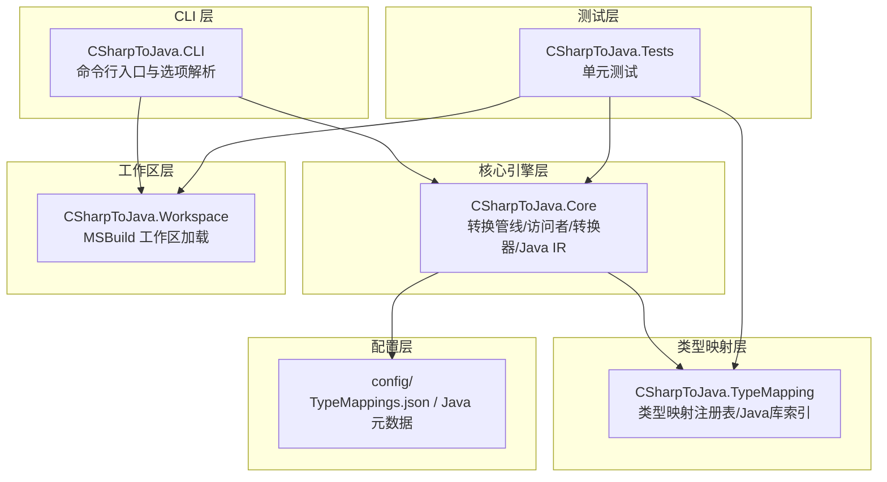
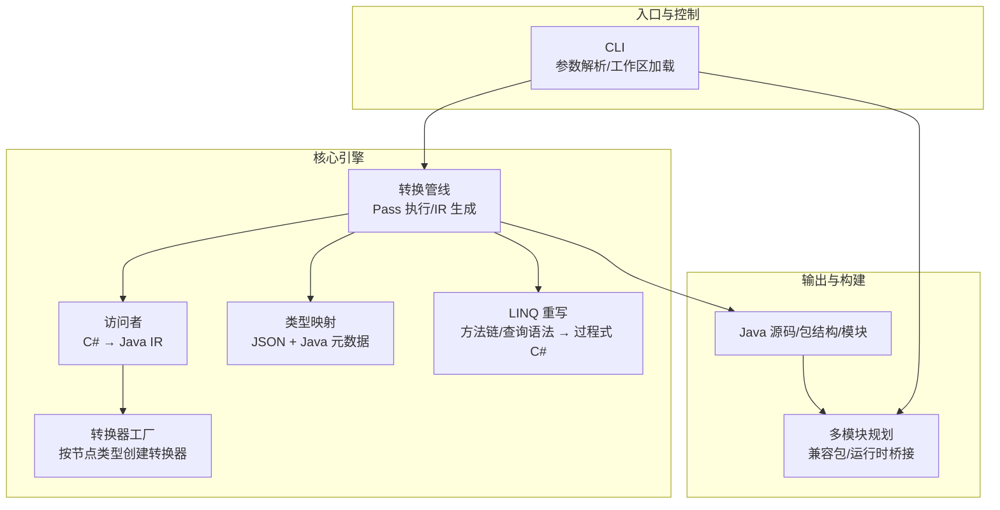
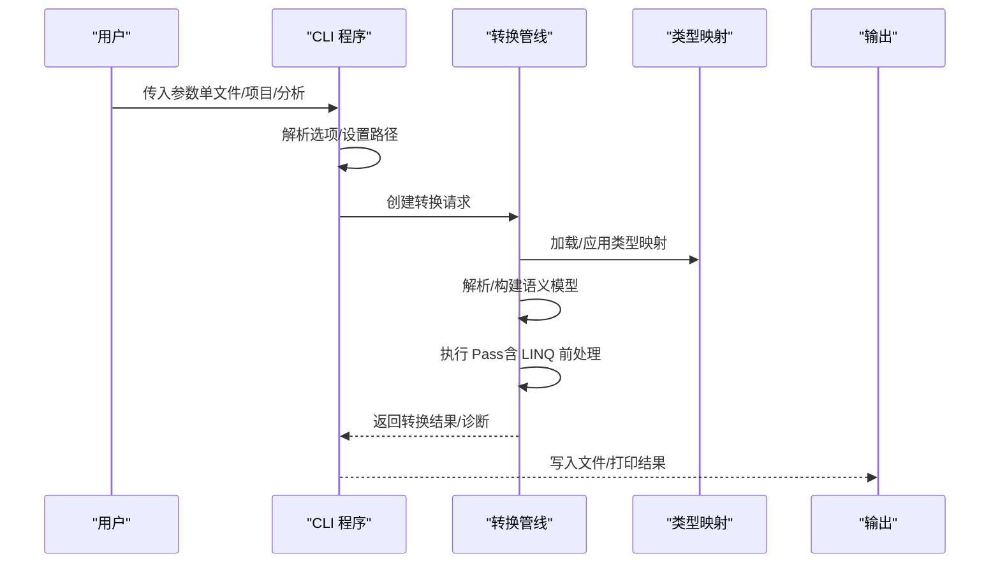
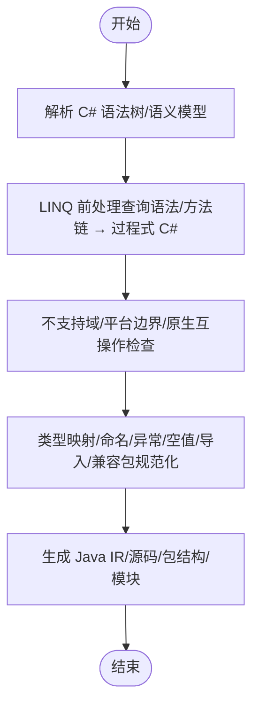
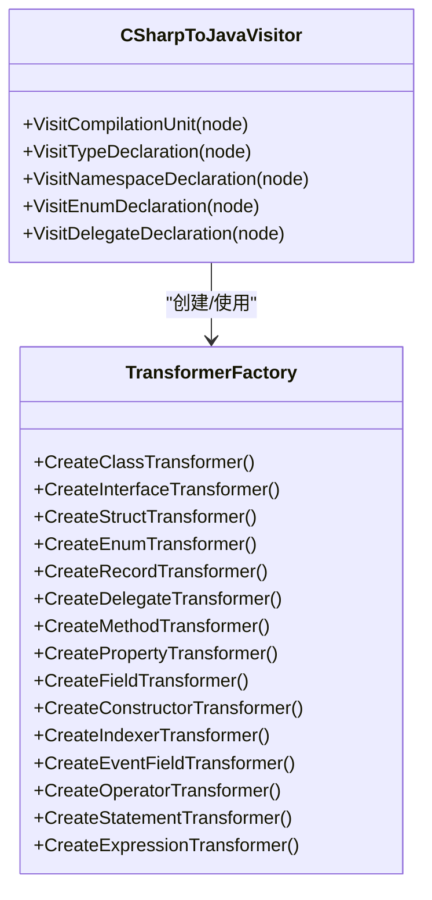
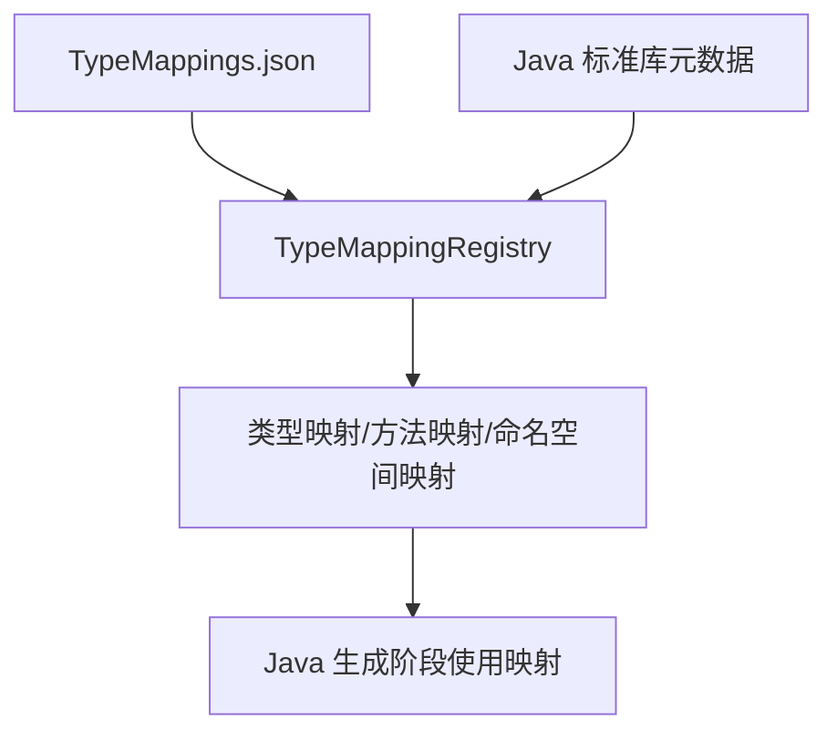
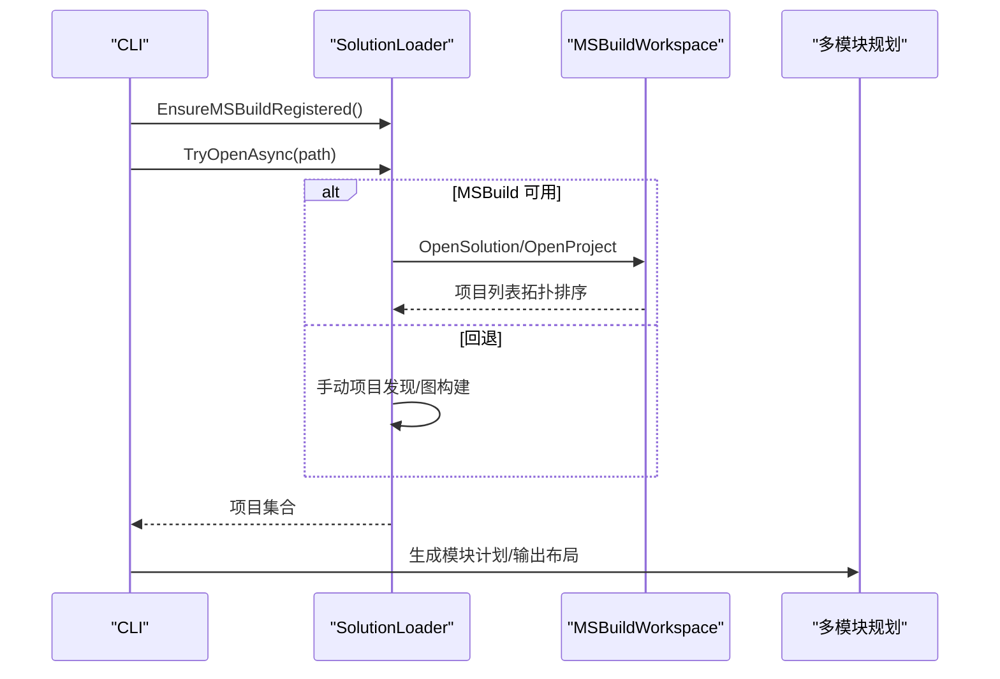
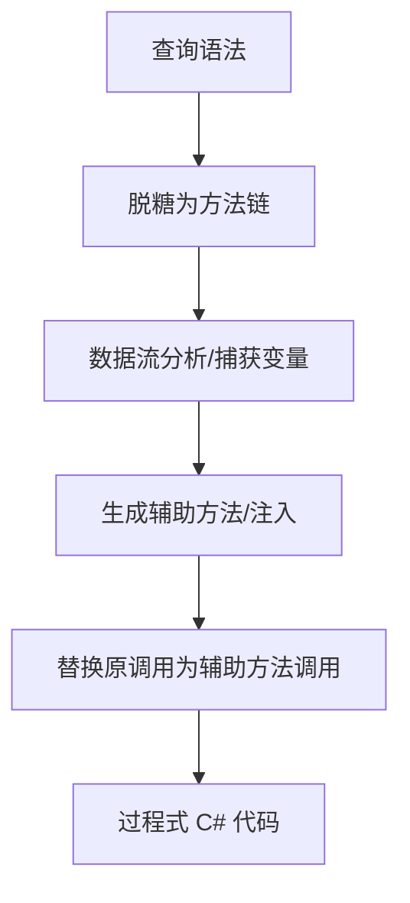
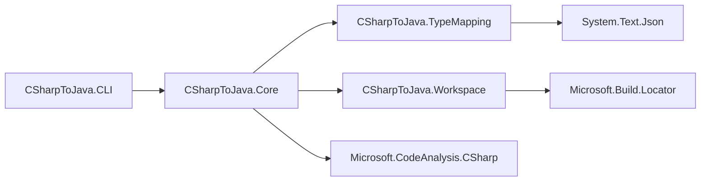

# 项目概述

<cite>
**本文引用的文件**
- [README.md](file://README.md)
- [Program.cs](file://src/CSharpToJava.CLI/Program.cs)
- [ConversionPipeline.cs](file://src/CSharpToJava.Core/Pipeline/ConversionPipeline.cs)
- [TypeMappingRegistry.cs](file://src/CSharpToJava.TypeMapping/TypeMappingRegistry.cs)
- [SolutionLoader.cs](file://src/CSharpToJava.Workspace/SolutionLoader.cs)
- [TypeMappings.json](file://config/TypeMappings.json)
- [CSharpToJava.Core.csproj](file://src/CSharpToJava.Core/CSharpToJava.Core.csproj)
- [CSharpToJava.TypeMapping.csproj](file://src/CSharpToJava.TypeMapping/CSharpToJava.TypeMapping.csproj)
- [CSharpToJavaVisitor.cs](file://src/CSharpToJava.Core/Visitors/CSharpToJavaVisitor.cs)
- [TransformerFactory.cs](file://src/CSharpToJava.Core/Transformers/TransformerFactory.cs)
- [linq-rewrite-engine-architecture.md](file://docs/linq-rewrite-engine-architecture.md)
- [j2cl-architecture-upgrade.md](file://docs/j2cl-architecture-upgrade.md)
</cite>

## 目录
1. [简介](#简介)
2. [项目结构](#项目结构)
3. [核心组件](#核心组件)
4. [架构总览](#架构总览)
5. [详细组件分析](#详细组件分析)
6. [依赖分析](#依赖分析)
7. [性能考虑](#性能考虑)
8. [故障排查指南](#故障排查指南)
9. [结论](#结论)
10. [附录](#附录)

## 简介
cs2j 是一个基于 Roslyn 的 C# 到 Java 源码转换工具，旨在将 C# 代码稳定地转换为现代 Java（最高支持 Java 25）源码。项目采用“配置驱动 + 语义驱动”的架构，结合 LINQ 前处理、类型映射系统、项目级转换与增量输出等能力，覆盖从单文件转换到大型解决方案转换的多种使用场景。

- 核心目标：以 Roslyn 为解析与语义分析引擎，提供高保真、可编译的 Java 输出，支持现代 Java 特性（如 Records、Optional 等）与 .NET 语义的合理映射。
- 主要特性：类型映射配置（JSON 驱动）、LINQ 重写（过程式 C# → Java）、async/await → CompletableFuture、Java Records 支持、项目级转换与部分类型合并、MSBuild 工作区加载、多模块输出与兼容包管理。
- 使用场景：单文件转换、项目级转换、大型解决方案转换、CI 增量转换、生成可编译的 Java 源码用于进一步构建与测试。

**章节来源**
- [README.md:1-84](file://README.md#L1-L84)

## 项目结构
项目采用多项目分层组织：
- CLI 层：命令行界面，负责参数解析、工作区加载、项目发现与输出管理。
- 核心引擎层：基于 Roslyn 的转换管线、类型映射、LINQ 重写、访问者与转换器工厂、Java IR 生成。
- 类型映射层：JSON 配置驱动的类型/方法/命名空间映射注册表。
- 工作区层：MSBuild 工作区加载与项目图构建。
- 配置层：默认类型映射配置与 Java 标准库元数据索引。
- 测试层：覆盖转换、类型映射、LINQ 重写、项目级转换等场景的单元测试。

**图表来源**
- [Program.cs:1-800](file://src/CSharpToJava.CLI/Program.cs#L1-L800)
- [ConversionPipeline.cs:1-443](file://src/CSharpToJava.Core/Pipeline/ConversionPipeline.cs#L1-L443)
- [TypeMappingRegistry.cs:1-562](file://src/CSharpToJava.TypeMapping/TypeMappingRegistry.cs#L1-L562)
- [SolutionLoader.cs:1-215](file://src/CSharpToJava.Workspace/SolutionLoader.cs#L1-L215)
- [CSharpToJava.Core.csproj:1-19](file://src/CSharpToJava.Core/CSharpToJava.Core.csproj#L1-L19)
- [CSharpToJava.TypeMapping.csproj:1-14](file://src/CSharpToJava.TypeMapping/CSharpToJava.TypeMapping.csproj#L1-L14)

**章节来源**
- [README.md:64-74](file://README.md#L64-L74)
- [Program.cs:11-304](file://src/CSharpToJava.CLI/Program.cs#L11-L304)

## 核心组件
- CLI 程序入口：解析命令行参数，选择转换模式（单文件/项目/分析），初始化转换选项与类型映射路径，调用转换管线并输出结果。
- 转换管线：单文件与项目级转换的统一入口，负责解析、构建语义模型、执行 Pass（含 LINQ 前处理）、生成 Java IR 与源码。
- 访问者与转换器：基于 Roslyn 的访问者模式，将 C# 语法节点映射到 Java IR；转换器工厂按节点类型创建专用转换器。
- 类型映射系统：JSON 驱动的类型/方法/命名空间映射注册表，支持 Java 标准库元数据索引以增强推断与校验。
- 工作区加载：通过 MSBuild 工作区加载解决方案或项目，构建项目依赖图，支持多模块规划与增量输出。
- LINQ 重写引擎：将 LINQ 方法链与查询语法重写为过程式 C# 代码，降低主管线复杂度，提升可移植性。

**章节来源**
- [Program.cs:27-304](file://src/CSharpToJava.CLI/Program.cs#L27-L304)
- [ConversionPipeline.cs:67-443](file://src/CSharpToJava.Core/Pipeline/ConversionPipeline.cs#L67-L443)
- [CSharpToJavaVisitor.cs:15-200](file://src/CSharpToJava.Core/Visitors/CSharpToJavaVisitor.cs#L15-L200)
- [TransformerFactory.cs:16-58](file://src/CSharpToJava.Core/Transformers/TransformerFactory.cs#L16-L58)
- [TypeMappingRegistry.cs:93-562](file://src/CSharpToJava.TypeMapping/TypeMappingRegistry.cs#L93-L562)
- [SolutionLoader.cs:12-215](file://src/CSharpToJava.Workspace/SolutionLoader.cs#L12-L215)
- [linq-rewrite-engine-architecture.md:1-608](file://docs/linq-rewrite-engine-architecture.md#L1-L608)

## 架构总览
cs2j 的架构以“唯一目标语言为 Java”为核心，吸收 J2CL 的“批处理根对象 + 显式 Pass”经验，形成“load/parse → desugar → check → normalize → emit”的主线流程。CLI 作为入口，统一单文件、项目、解决方案三种输入；核心引擎基于 Roslyn 构建语法与语义模型，通过访问者与转换器生成 Java IR；类型映射系统提供配置驱动的映射与校验；LINQ 前处理将复杂语义降级为过程式 C#；工作区层提供 MSBuild 支持与多模块规划；输出层生成 Java 源码、包结构与构建映射。

**图表来源**
- [j2cl-architecture-upgrade.md:112-260](file://docs/j2cl-architecture-upgrade.md#L112-L260)
- [Program.cs:111-747](file://src/CSharpToJava.CLI/Program.cs#L111-L747)
- [ConversionPipeline.cs:115-339](file://src/CSharpToJava.Core/Pipeline/ConversionPipeline.cs#L115-L339)
- [CSharpToJavaVisitor.cs:29-116](file://src/CSharpToJava.Core/Visitors/CSharpToJavaVisitor.cs#L29-L116)
- [TransformerFactory.cs:16-58](file://src/CSharpToJava.Core/Transformers/TransformerFactory.cs#L16-L58)
- [TypeMappingRegistry.cs:130-210](file://src/CSharpToJava.TypeMapping/TypeMappingRegistry.cs#L130-L210)
- [linq-rewrite-engine-architecture.md:394-425](file://docs/linq-rewrite-engine-architecture.md#L394-L425)

## 详细组件分析

### CLI 界面与控制流
- 单文件转换：读取输入文件，构建转换选项（目标 Java 版本、类型映射路径、是否启用 LINQ 重写、是否生成 JavaDoc 等），调用转换管线，输出结果或错误诊断。
- 项目级转换：优先尝试 MSBuild 工作区加载，若失败则回退到手动项目发现；支持单模块与多模块输出，生成 pom/构建映射与增量输出缓存；支持并行与增量复用。
- 分析模式：对项目进行类型映射覆盖率分析，生成报告。

**图表来源**
- [Program.cs:27-304](file://src/CSharpToJava.CLI/Program.cs#L27-L304)
- [ConversionPipeline.cs:115-221](file://src/CSharpToJava.Core/Pipeline/ConversionPipeline.cs#L115-L221)
- [TypeMappingRegistry.cs:130-210](file://src/CSharpToJava.TypeMapping/TypeMappingRegistry.cs#L130-L210)

**章节来源**
- [Program.cs:27-304](file://src/CSharpToJava.CLI/Program.cs#L27-L304)
- [Program.cs:111-747](file://src/CSharpToJava.CLI/Program.cs#L111-L747)

### 转换管线与 Pass 体系
- 单文件管线：解析 C# 语法树与语义模型，执行一系列显式 Pass（LINQ 前处理、编译检查、不支持域检查、平台边界检查、原生互操作检查、上下文标准化、Java 生成），最终生成 Java 源码。
- 项目级管线：批量处理多个文件，支持 partial 类型合并、跨项目符号解析、兼容包生成与导入处理。
- LINQ 前处理：将 LINQ 查询语法与方法链重写为过程式 C#，并在完成后重建语义模型，确保后续 Pass 在“过程式 C#”上执行。

**图表来源**
- [ConversionPipeline.cs:115-339](file://src/CSharpToJava.Core/Pipeline/ConversionPipeline.cs#L115-L339)
- [linq-rewrite-engine-architecture.md:264-425](file://docs/linq-rewrite-engine-architecture.md#L264-L425)

**章节来源**
- [ConversionPipeline.cs:67-443](file://src/CSharpToJava.Core/Pipeline/ConversionPipeline.cs#L67-L443)
- [linq-rewrite-engine-architecture.md:1-608](file://docs/linq-rewrite-engine-architecture.md#L1-L608)

### 访问者与转换器系统
- 访问者：继承 Roslyn 的 C# 访问者，遍历编译单元，处理 using、命名空间、类型声明、委托等，将节点映射到 Java IR。
- 转换器工厂：按节点类型创建专用转换器（类/接口/结构/枚举/记录、方法/属性/字段/构造函数/索引器、事件/运算符、语句、表达式），实现细粒度转换。
- Java IR：结构化的 Java 语法节点，支持修饰符、导入、类型声明、成员声明、表达式、语句等，便于重写与生成。

**图表来源**
- [CSharpToJavaVisitor.cs:15-200](file://src/CSharpToJava.Core/Visitors/CSharpToJavaVisitor.cs#L15-L200)
- [TransformerFactory.cs:16-58](file://src/CSharpToJava.Core/Transformers/TransformerFactory.cs#L16-L58)

**章节来源**
- [CSharpToJavaVisitor.cs:15-200](file://src/CSharpToJava.Core/Visitors/CSharpToJavaVisitor.cs#L15-L200)
- [TransformerFactory.cs:16-58](file://src/CSharpToJava.Core/Transformers/TransformerFactory.cs#L16-L58)

### 类型映射系统
- 配置驱动：TypeMappings.json 定义 C# 类型到 Java 类型、方法名、命名空间的映射，支持导入列表与转换器名称。
- 注册表：TypeMappingRegistry 负责加载配置、解析泛型与可空类型、方法重载解析、命名空间映射、Java 标准库索引集成（用于方法名推断与类型校验）。
- 元数据索引：可加载 Java 标准库元数据，自动推断方法名映射（PascalCase → camelCase）并校验 Java 类型存在性。

**图表来源**
- [TypeMappingRegistry.cs:130-210](file://src/CSharpToJava.TypeMapping/TypeMappingRegistry.cs#L130-L210)
- [TypeMappings.json:1-800](file://config/TypeMappings.json#L1-L800)

**章节来源**
- [TypeMappingRegistry.cs:93-562](file://src/CSharpToJava.TypeMapping/TypeMappingRegistry.cs#L93-L562)
- [TypeMappings.json:1-800](file://config/TypeMappings.json#L1-L800)

### 工作区加载与多模块规划
- MSBuild 工作区：通过 MSBuildLocator 注册后，使用 MSBuildWorkspace 打开 .sln/.csproj，构建项目依赖图，按拓扑顺序编译项目，提取 Compilation 与文档。
- 项目发现：若 MSBuild 不可用，回退到目录扫描与项目图构建，支持多项目与测试项目区分。
- 多模块输出：根据项目依赖与测试项目类型生成模块布局，输出 pom/构建映射与兼容包。

**图表来源**
- [SolutionLoader.cs:24-215](file://src/CSharpToJava.Workspace/SolutionLoader.cs#L24-L215)
- [Program.cs:150-213](file://src/CSharpToJava.CLI/Program.cs#L150-L213)

**章节来源**
- [SolutionLoader.cs:12-215](file://src/CSharpToJava.Workspace/SolutionLoader.cs#L12-L215)
- [Program.cs:111-747](file://src/CSharpToJava.CLI/Program.cs#L111-L747)

### LINQ 重写引擎
- 目标：将 LINQ 查询语法与方法链重写为过程式 C# 代码，使主管线无需理解 LINQ 语义即可生成 Java。
- 阶段：查询语法脱糖（from/where/select/orderby/group by 等）→ 方法链展开（Where/Select/Aggregate/ToList 等）→ 生成辅助方法与注入。
- 可观测性：统计脱糖次数、展开次数、跳过链数量与原因，支持按文件/操作符维度的覆盖率报告。

**图表来源**
- [linq-rewrite-engine-architecture.md:264-425](file://docs/linq-rewrite-engine-architecture.md#L264-L425)

**章节来源**
- [linq-rewrite-engine-architecture.md:1-608](file://docs/linq-rewrite-engine-architecture.md#L1-L608)

## 依赖分析
- 外部依赖：Microsoft.CodeAnalysis.CSharp（Roslyn）、System.Text.Json（配置与元数据）、Microsoft.Build.Locator（MSBuild）。
- 内部依赖：CLI 依赖核心引擎与类型映射；核心引擎依赖类型映射与工作区；类型映射依赖 JSON 序列化；工作区依赖 MSBuild。

**图表来源**
- [CSharpToJava.Core.csproj:9-16](file://src/CSharpToJava.Core/CSharpToJava.Core.csproj#L9-L16)
- [CSharpToJava.TypeMapping.csproj:9-11](file://src/CSharpToJava.TypeMapping/CSharpToJava.TypeMapping.csproj#L9-L11)

**章节来源**
- [CSharpToJava.Core.csproj:1-19](file://src/CSharpToJava.Core/CSharpToJava.Core.csproj#L1-L19)
- [CSharpToJava.TypeMapping.csproj:1-14](file://src/CSharpToJava.TypeMapping/CSharpToJava.TypeMapping.csproj#L1-L14)

## 性能考虑
- 增量与缓存：CLI 支持输入指纹快照与增量写入会话，避免重复转换；项目级转换支持并行与 Pass 指标统计。
- 并行执行：项目级转换按项目/模块/类型组并行执行安全的 Pass，共享只读符号索引，保持结果稳定。
- 内存治理：在 Library 级统一资源释放，建立声明库存与跨项目符号索引，减少重复扫描。
- 大项目优化：分模块输出、受控缓存上限、按依赖图失效传播，单文件变化仅重跑受影响子集。

**章节来源**
- [j2cl-architecture-upgrade.md:260-304](file://docs/j2cl-architecture-upgrade.md#L260-L304)
- [Program.cs:170-294](file://src/CSharpToJava.CLI/Program.cs#L170-L294)

## 故障排查指南
- 输入与路径问题：检查输入文件/项目是否存在，MSBuild 是否可用；CLI 会在错误时输出详细诊断。
- 类型映射配置：确认 TypeMappings.json 路径与格式正确；若配置损坏，注册表会抛出配置异常。
- 诊断输出：CLI 支持详细诊断输出（-v/--verbose），显示严重级别与诊断详情；转换失败时优先查看诊断列表。
- 平台边界与不支持域：检查是否包含 WinForms/WPF/原生互操作/反射重度依赖等不支持内容；可在 check 阶段提前发现。
- LINQ 重写：若某些 LINQ 链未被重写，查看跳过原因与覆盖率报告，逐步补齐规则。

**章节来源**
- [Program.cs:27-109](file://src/CSharpToJava.CLI/Program.cs#L27-L109)
- [TypeMappingRegistry.cs:130-182](file://src/CSharpToJava.TypeMapping/TypeMappingRegistry.cs#L130-L182)
- [linq-rewrite-engine-architecture.md:452-475](file://docs/linq-rewrite-engine-architecture.md#L452-L475)

## 结论
cs2j 通过“配置驱动 + 语义驱动”的架构，将 Roslyn 的强解析能力与可扩展的转换管线相结合，实现了从单文件到大型解决方案的稳定转换。LINQ 前处理、类型映射系统、MSBuild 工作区与多模块输出等能力，使其在工程化场景中具备良好的可维护性与可观测性。面向 Java-only 的架构升级方向，将进一步强化“批处理根对象 + 显式 Pass + 前置检查 + 兼容包/运行时桥接”的工业级能力，支撑复杂 C# 代码库的高质量 Java 转换。

[无章节来源：总结性内容]

## 附录
- 使用场景与示例：单文件转换、项目级转换、分析类型映射覆盖率、生成多模块 pom 与增量输出。
- CLI 选项与参数：输入/输出、类型映射配置、Java 版本、是否启用 LINQ 重写、是否生成 JavaDoc、并行与增量相关选项等。
- 设计文档：LINQ 重写引擎架构、Java-only 大型项目架构升级方向等。

**章节来源**
- [README.md:30-63](file://README.md#L30-L63)
- [Program.cs:11-25](file://src/CSharpToJava.CLI/Program.cs#L11-L25)
- [j2cl-architecture-upgrade.md:1-423](file://docs/j2cl-architecture-upgrade.md#L1-L423)
- [linq-rewrite-engine-architecture.md:1-608](file://docs/linq-rewrite-engine-architecture.md#L1-L608)